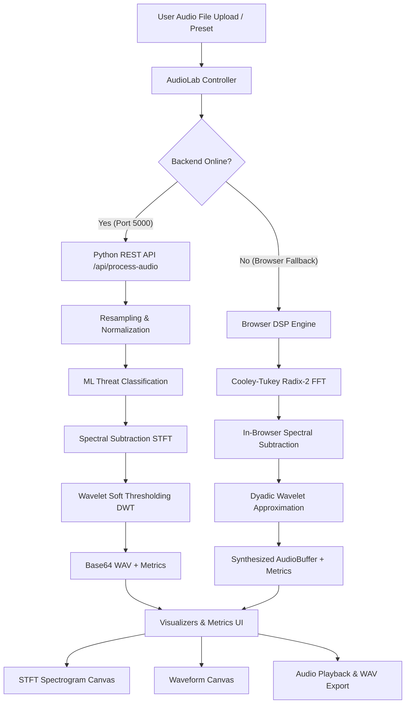

# NoiseX — Intelligent Noise Suppression & Tactical DSP Suite

> **Aerospace & Defence Grade Adaptive Audio Processing Engine**  
> Accelerated on AMD Xilinx Zynq UltraScale+ FPGA with in-browser and Python DSP fallbacks.

---

## 📁 Repository Structure & Directory Map

The codebase is organized into modular components for frontend UI, signal processing engines, canvas visualizers, and backend microservices:

```
SIH/
├── README.md                   # Complete architectural guide & codebase map
├── index.html                  # Main SPA HTML structure (8 interactive view sections)
├── serve.sh                    # Simple local web server (Python http.server on port 8000)
│
├── assets/                     # Static media & reference audio files
│   ├── logo.png                # Tactical brand asset (screen blended)
│   └── audio/                  # Reference tactical battlefield WAV recordings
│       ├── drone_combat.wav
│       ├── emergency_siren.wav
│       ├── gunfire_impulsive.wav
│       ├── heavy_engine.wav
│       ├── helicopter_cockpit.wav
│       └── wind_shear.wav
│
├── css/                        # Modular Cascading Style Sheets
│   ├── styles.css              # Core design system tokens, typography, grid backgrounds
│   └── components.css          # UI component styles (metric cards, checklists, status badges, player)
│
├── js/                         # Frontend Application JavaScript
│   ├── app.js                  # Main application bootstrapper & lifecycle init
│   ├── config.js               # Client theme configuration & constants
│   │
│   ├── core/                   # DSP & Machine Learning engines
│   │   ├── dsp-engine.js       # In-browser STFT + Spectral Subtraction + Wavelet soft-thresholding
│   │   └── audio-classifier.js # Temporal/spectral feature extraction & threat vector classification
│   │
│   ├── visualizers/            # HTML5 Canvas real-time audio renderers
│   │   ├── spectrogram.js      # True STFT magnitude spectrogram renderer (Magma colormap)
│   │   └── waveform.js         # Interactive time-domain waveform visualizer
│   │
│   ├── controllers/            # UI state managers & event routers
│   │   ├── audio-lab.js        # Audio Lab controller (upload, decode, pipeline orchestration, playback)
│   │   └── router.js           # Hash-based SPA routing & scroll-reveal intersection observers
│   │
│   └── data/                   # Grounded benchmark data & threat vector catalog
│       └── benchmark-data.js   # Real Xilinx FPGA hardware benchmarks & acoustic threat matrix
│
└── backend/                    # Python DSP & Machine Learning Service
    ├── app.py                  # Flask REST API server exposing /health and /api/process-audio
    ├── requirements.txt        # Python package dependencies
    ├── run.sh                  # Backend launcher script
    │
    ├── audio/                  # Audio I/O utilities
    │   └── preprocessing.py    # Resampling, mono downmix, peak normalization, metadata calculation
    │
    ├── dsp/                    # Scientific signal processing algorithms
    │   ├── stft.py             # Forward and inverse STFT using scipy.signal
    │   ├── spectral_subtraction.py # Over-subtraction stationary noise filter
    │   └── wavelet.py          # Multi-level DWT VisuShrink soft thresholding (PyWavelets)
    │
    └── ml/                     # Machine learning classification
        └── classifier.py       # Feature extraction (RMS, peak, crest factor, ZCR, kurtosis) & threat detection
```

---

## ⚙️ Architecture & Data Flow

### 1. Dual-Engine Processing Pipeline


### 2. Signal Processing Steps
1. **Downmix & Resample**: Converts input audio to mono 16 kHz for standard vocal intelligibility band.
2. **Noise Profiling**: Analyzes initial frames (assumed ambient noise prefix) to determine background power spectrum.
3. **Spectral Subtraction**: Over-subtracts estimated noise magnitude with spectral flooring to prevent musical noise artifacts.
4. **Wavelet Thresholding**: Applies VisuShrink soft-thresholding across dyadic DWT detail sub-bands to remove residual broadband clutter.
5. **Reconstruction**: Reconstructs cleaned audio with original phase and normalizes peak amplitude.

---

## 🚀 How to Run

### Option 1: Frontend Only (Browser DSP Engine)
Run the built-in HTTP server:
```bash
./serve.sh
```
Open **http://localhost:8000** in your browser. All audio processing will run directly in WebAssembly/JavaScript via the browser DSP engine.

### Option 2: Full Stack (Frontend + Python DSP Backend)
1. **Start the Python Backend**:
   ```bash
   cd backend
   pip install -r requirements.txt
   python3 app.py
   ```
   *(Backend runs on `http://localhost:5000`)*

2. **Start the Frontend**:
   ```bash
   ./serve.sh
   ```
   Open **http://localhost:8000**. The Audio Lab will automatically detect the Python backend and display **`● Python DSP Backend — Online`**.

---

## 🧪 Verification & Testing
- **Preset Testing**: Navigate to `#/audio-lab` and test presets or upload custom audio.
- **Visualizations**: Both the waveform canvas and STFT spectrogram reflect exact mathematical transformations of the audio buffer.
- **Hardware Benchmarks**: View `#/results` and `#/architecture` to inspect AMD Xilinx Zynq UltraScale+ hardware utilization, power analysis, and latency metrics.
