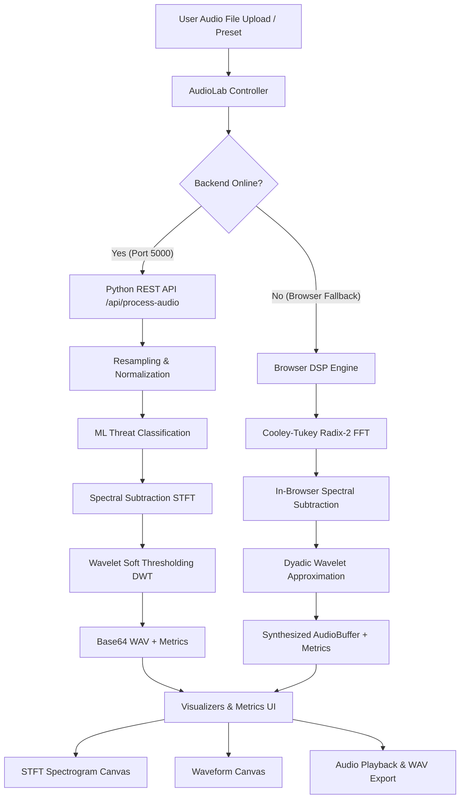

# NoiseX — Intelligent Noise Suppression & Tactical DSP Suite

> **Aerospace & Defence Grade Audio Processing Engine**  
> Accelerated on Xilinx Zynq-7000 (PYNQ-Z2) with in-browser and Python DSP fallbacks.

---

## 📁 Repository Structure & Directory Map

The codebase is organized into modular components for frontend UI, signal processing engines, canvas visualizers, and backend microservices:

`graph TD
    classDef root fill:#1e293b,stroke:#3b82f6,stroke-width:2px,color:#f8fafc;
    classDef client fill:#0f172a,stroke:#06b6d4,stroke-width:1.5px,color:#f8fafc;
    classDef backend fill:#0f172a,stroke:#8b5cf6,stroke-width:1.5px,color:#f8fafc;
    classDef file fill:#1e1e2e,stroke:#475569,stroke-width:1px,color:#94a3b8;

    subgraph SIH["SIH Project Root"]
        R1["index.html<br/>SPA Shell"]:::file
        R2["serve.sh<br/>Port 8000 Server"]:::file
        R3["README.md<br/>Documentation"]:::file

        subgraph ASSETS["assets/"]
            A1["logo.png"]:::file
            A2["audio/<br/>6 Tactical Reference WAVs"]:::file
        end

        subgraph FRONTEND["Frontend Architecture"]
            CSS["css/<br/>styles.css & components.css"]:::file
            J1["js/core/<br/>dsp-engine.js<br/>audio-classifier.js"]:::client
            J2["js/visualizers/<br/>spectrogram.js<br/>waveform.js"]:::client
            J3["js/controllers/<br/>audio-lab.js<br/>router.js"]:::client
            J4["js/data/<br/>benchmark-data.js"]:::file
        end

        subgraph BACKEND["Python DSP Backend"]
            B1["app.py<br/>Flask REST API"]:::backend
            B2["audio/<br/>preprocessing.py"]:::backend
            B3["dsp/<br/>stft.py<br/>spectral_subtraction.py<br/>wavelet.py"]:::backend
            B4["ml/<br/>classifier.py"]:::backend
        end
    end

---

## ⚙️ Architecture & Data Flow

### 1. Dual-Engine Processing Pipeline


### 2. Signal Processing Steps
1. **Downmix & Resample**: Converts input audio to mono 16 kHz for standard vocal intelligibility band.
2. **Noise Profiling**: Analyzes initial frames (assumed ambient noise prefix) to determine background power spectrum.
3. **Spectral Subtraction**: Over-subtracts estimated noise magnitude with spectral flooring to prevent musical noise artifacts.
4. **Wavelet Thresholding**: Applies VisuShrink soft-thresholding across dyadic DWT detail sub-bands to remove residual broadband clutter.
5. **Reconstruction**: Reconstructs cleaned audio with original phase and normalizes peak amplitude.

---

## 🚀 How to Run

### Option 1: Frontend Only (Browser DSP Engine)
Run the built-in HTTP server:
```bash
./serve.sh
```
Open **http://localhost:8000** in your browser. All audio processing will run directly in WebAssembly/JavaScript via the browser DSP engine.

### Option 2: Full Stack (Frontend + Python DSP Backend)
1. **Start the Python Backend**:
   ```bash
   cd backend
   pip install -r requirements.txt
   python3 app.py
   ```
   *(Backend runs on `http://localhost:5000`)*

2. **Start the Frontend**:
   ```bash
   ./serve.sh
   ```
   Open **http://localhost:8000**. The Audio Lab will automatically detect the Python backend and display **`● Python DSP Backend — Online`**.

---

## 🧪 Verification & Testing
- **Preset Testing**: Navigate to `#/audio-lab` and test presets or upload custom audio.
- **Visualizations**: Both the waveform canvas and STFT spectrogram reflect exact mathematical transformations of the audio buffer.
- **Hardware Benchmarks**: View `#/architecture` to inspect Xilinx Zynq-7000 (PYNQ-Z2) hardware utilization, power analysis, and latency metrics.
