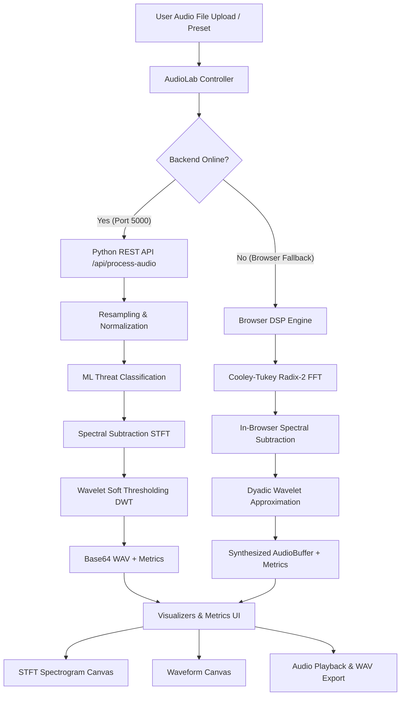

# NoiseX — Intelligent Noise Suppression & Tactical DSP Suite

> **Aerospace & Defence Grade Audio Processing Engine**  
> Accelerated on Xilinx Zynq-7000 (PYNQ-Z2) with in-browser and Python DSP fallbacks.

---

## 📁 Repository Structure & Directory Map

## 📂 Repository Structure & Directory Map

The codebase is organized into modular components separating the browser interface, DSP engines, interactive visualizers, and backend ML microservices:

```text
SIH/
├── index.html                     # Main Single Page Application shell
├── serve.sh                       # Local HTTP runtime runner (port 8000)
├── README.md                      # System documentation & architectural specs
│
├── assets/                        # Static UI assets and verified acoustic clips
│   ├── logo.png
│   └── audio/                     # Tactical reference benchmarks (16kHz WAVs)
│       ├── drone_combat.wav
│       ├── emergency_siren.wav
│       ├── gunfire_impulsive.wav
│       ├── heavy_engine.wav
│       ├── helicopter_cockpit.wav
│       └── wind_shear.wav
│
├── css/                           # Design system and UI layouts
│   ├── styles.css                 # Base theme and typography
│   └── components.css             # Scoped component styles
│
├── js/                            # Client-side audio processing & visualizer engine
│   ├── core/
│   │   ├── dsp-engine.js          # Web Audio API real-time processing graph
│   │   └── audio-classifier.js    # Client-side telemetry and dispatch
│   ├── visualizers/
│   │   ├── spectrogram.js         # Real-time WebGL/Canvas spectrogram renderer
│   │   └── waveform.js            # Time-domain waveform renderer
│   ├── controllers/
│   │   ├── audio-lab.js           # Audio Lab workflow controller & badge bindings
│   │   └── router.js              # View switcher and hash navigation
│   └── data/
│       └── benchmark-data.js      # Baseline PESQ, STOI, and SNR metrics
│
└── backend/                       # Python DSP & Machine Learning Microservice
    ├── app.py                     # Flask REST API endpoint (/api/process-audio)
    ├── audio/
    │   └── preprocessing.py       # Resampling (16kHz), window framing & normalization
    ├── dsp/
    │   ├── stft.py                # Short-Time Fourier Transform routines
    │   ├── spectral_subtraction.py# Adaptive over-subtraction filter
    │   ├── wavelet.py             # DWT decomposition (db4/db10) & thresholding
    │   └── metrics.py             # Objective evaluation (SNR, PESQ, STOI)
    └── ml/
        ├── classifier.py          # Log-Mel sliding-window inference pipeline
        └── models/
            └── acoustic_env_rf.pkl# Trained 6-class Random Forest model## 📂 Repository Structure & Directory Map

The codebase is organized into modular components separating the browser interface, DSP engines, interactive visualizers, and backend ML microservices:

```text
SIH/
├── index.html                     # Main Single Page Application shell
├── serve.sh                       # Local HTTP runtime runner (port 8000)
├── README.md                      # System documentation & architectural specs
│
├── assets/                        # Static UI assets and verified acoustic clips
│   ├── logo.png
│   └── audio/                     # Tactical reference benchmarks (16kHz WAVs)
│       ├── drone_combat.wav
│       ├── emergency_siren.wav
│       ├── gunfire_impulsive.wav
│       ├── heavy_engine.wav
│       ├── helicopter_cockpit.wav
│       └── wind_shear.wav
│
├── css/                           # Design system and UI layouts
│   ├── styles.css                 # Base theme and typography
│   └── components.css             # Scoped component styles
│
├── js/                            # Client-side audio processing & visualizer engine
│   ├── core/
│   │   ├── dsp-engine.js          # Web Audio API real-time processing graph
│   │   └── audio-classifier.js    # Client-side telemetry and dispatch
│   ├── visualizers/
│   │   ├── spectrogram.js         # Real-time WebGL/Canvas spectrogram renderer
│   │   └── waveform.js            # Time-domain waveform renderer
│   ├── controllers/
│   │   ├── audio-lab.js           # Audio Lab workflow controller & badge bindings
│   │   └── router.js              # View switcher and hash navigation
│   └── data/
│       └── benchmark-data.js      # Baseline PESQ, STOI, and SNR metrics
│
└── backend/                       # Python DSP & Machine Learning Microservice
    ├── app.py                     # Flask REST API endpoint (/api/process-audio)
    ├── audio/
    │   └── preprocessing.py       # Resampling (16kHz), window framing & normalization
    ├── dsp/
    │   ├── stft.py                # Short-Time Fourier Transform routines
    │   ├── spectral_subtraction.py# Adaptive over-subtraction filter
    │   ├── wavelet.py             # DWT decomposition (db4/db10) & thresholding
    │   └── metrics.py             # Objective evaluation (SNR, PESQ, STOI)
    └── ml/
        ├── classifier.py          # Log-Mel sliding-window inference pipeline
        └── models/
            └── acoustic_env_rf.pkl# Trained 6-class Random Forest model


---

## ⚙️ Architecture & Data Flow

### 1. Dual-Engine Processing Pipeline


### 2. Signal Processing Steps
1. **Downmix & Resample**: Converts input audio to mono 16 kHz for standard vocal intelligibility band.
2. **Noise Profiling**: Analyzes initial frames (assumed ambient noise prefix) to determine background power spectrum.
3. **Spectral Subtraction**: Over-subtracts estimated noise magnitude with spectral flooring to prevent musical noise artifacts.
4. **Wavelet Thresholding**: Applies VisuShrink soft-thresholding across dyadic DWT detail sub-bands to remove residual broadband clutter.
5. **Reconstruction**: Reconstructs cleaned audio with original phase and normalizes peak amplitude.

---

## 🚀 How to Run

### Option 1: Frontend Only (Browser DSP Engine)
Run the built-in HTTP server:
```bash
./serve.sh
```
Open **http://localhost:8000** in your browser. All audio processing will run directly in WebAssembly/JavaScript via the browser DSP engine.

### Option 2: Full Stack (Frontend + Python DSP Backend)
1. **Start the Python Backend**:
   ```bash
   cd backend
   pip install -r requirements.txt
   python3 app.py
   ```
   *(Backend runs on `http://localhost:5000`)*

2. **Start the Frontend**:
   ```bash
   ./serve.sh
   ```
   Open **http://localhost:8000**. The Audio Lab will automatically detect the Python backend and display **`● Python DSP Backend — Online`**.

---

## 🧪 Verification & Testing
- **Preset Testing**: Navigate to `#/audio-lab` and test presets or upload custom audio.
- **Visualizations**: Both the waveform canvas and STFT spectrogram reflect exact mathematical transformations of the audio buffer.
- **Hardware Benchmarks**: View `#/architecture` to inspect Xilinx Zynq-7000 (PYNQ-Z2) hardware utilization, power analysis, and latency metrics.
